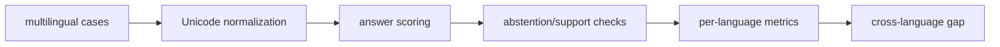

# Architecture

## Case layer
Pairs expected answers and model responses with explicit language labels and support flags.

## Normalizer
Preserves Unicode combining marks while removing irrelevant punctuation.

## Metrics
Computes correctness, abstention, unsupported answers, accuracy, and coverage by language.

## Gap analysis
Compares each language to a chosen reference without implying causal explanation.

## Design principle

Keep the task fixed and make language-conditioned reliability differences measurable.
